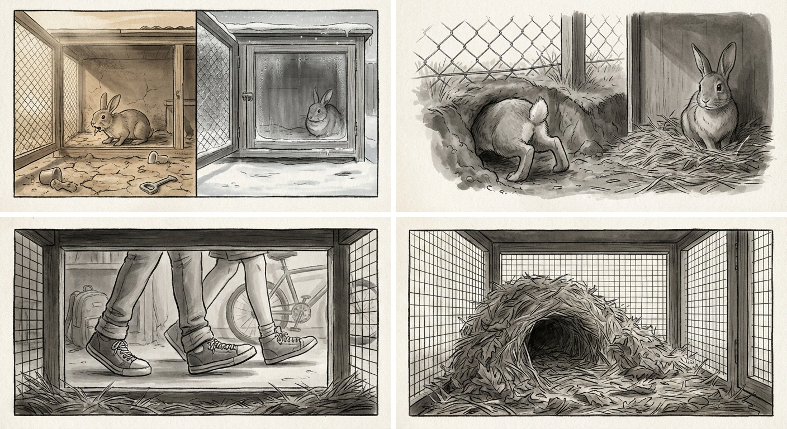

# Chapter 6: Middle Years

---

Routine deepens into the body.

The gate sounds each morning, each evening. The hands reach through with food and water. The yard holds its boundaries, and the boundaries hold the body that has traced them countless times.

The wire remains firm, reinforced those seasons ago. Sister still circles the perimeter each morning, nose testing for weakness that does not come. Sister still nests when spring arrives. The patterns repeat without variation, the seasons cycling, the years accumulating in worn paths and bodies that grow heavier, slower, grayer at the muzzle.

The tall-bodies have changed too. Their voices settled into lower registers, the breaking sounds giving way to smooth continuities. They visit less often now, the attention briefer.

The bodies in the yard adjust. Food comes when food comes. The rest fills with rest.

---

A new scent arrives with autumn.

Musty and sharp, carrying traces of ammonia. Something that hunts. The body freezes, heart quickening.

Predator.

The source appears above the fence. Small, fur patched orange and white. Young. It drops into the yard, lands clumsily.

The body flattens in the hollow. Sister does the same, breath quick beside.

The small predator moves forward, testing the ground. Ears high. Tail up.

---

Sister moves forward, toward it. Heart racing. Muscles tight. But something driving the body toward instead of away. This is the body that ate first, that led, that gnawed through wire.

The body rises onto haunches. Thumps.

The sound cracks through the air. The small predator startles, scrambles backward. Another thump. Sister lunges forward.

The predator leaps upward, catches the fence edge, pulls itself over. Gone.

---

The predator returns. Seasons pass and it grows. Each time it drops into the yard, each time sister rises, each time the thumping comes, each time it flees.

The pattern holds. The small predator learns.

---

It appears full-grown now. Thick-furred, eyes fixed on the hollow. But it does not enter. It lies on the far side of the fence, tail tip twitching. Watching.

Sister notices from the hollow. The heart quickens but the body does not rise. The predator has learned to stay beyond the boundary.

---

The joints ache more in damp weather now. The hops come slower. The urgency that once drove the body toward the beyond has settled into something quieter.

Sister notices: sister staying closer, resting longer. The grooming continues between them, tongue working through fur that has grown coarser.

Two bodies in the hollow as evening comes. The predator a presence at the edges, managed but not forgotten.

---

The hawthorn has grown. Its branches spread wider, the trunk thicker. The hollow beneath has expanded too, shaped by years of pressing bodies, worn smooth by fur and use.

Both bodies fit more easily now. Mutual wearing. Mutual shaping. The hollow is theirs in a way that goes beyond territory.

The tree marks seasons the body cannot count. The tree continues while the bodies slow beneath it.

---

The tall-bodies' visits grow briefer. Sometimes only hands appear, placing dishes, withdrawing. The attention has shifted to territories the body cannot map.

The bodies adjust. They eat what is given when it is given. The hollow, the warmth, sister pressed close.

---

Spring arrives and the pulling comes, but weaker than before. The hay-carrying continues, but the fur-pulling produces less. The nest takes longer to complete. The emptiness at the end arrives sooner, releases its grip faster.

The cycle weakens even as it continues.

---

The hops that once carried her across the yard now come with pauses between. The landing after each hop takes longer to settle.

Approaching the wire sometimes, nose pressed to mesh. The scents from beyond still drift through: forest, earth, the territories of others. Breathing it in, and that is enough.

Returning to the hollow instead. The familiar curve receives, the familiar warmth of sister pressing close.

---

Not youth anymore. Not age yet, though age presses at the edges, makes itself known in aching joints and slower movements.

The middle is now, and now contains everything: the hawthorn spreading above, the hollow worn smooth below, sister whose scent is indistinguishable from the smell of home.

The seasons will continue turning. The pattern will hold until something shifts it toward ending.

For now: the middle. The continuation. Two bodies in the hollow as the light fails, warmth shared, breathing synchronized.

This is what the years have made.

---
