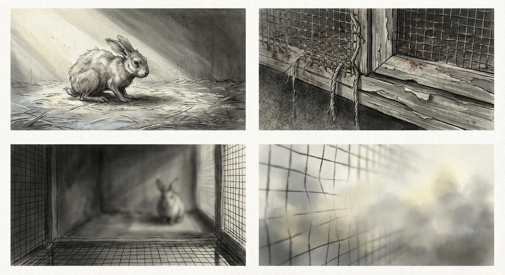

# Chapter 10: Return

---

Winter light lies thin across the ground.

The hawthorn stands bare above the hollow, branches reaching into gray sky.

The body moves less now. Steps come slowly, each one requiring more than the one before. The warmth that once ran through everything has begun to thin, to retreat toward the center.

The hollow still holds something. A trace of scent in the pressed earth, in the curved shape worn smooth by years of two bodies. One body now. The emptiness counts itself.

---

Frost comes in the mornings. The body waits for the warmth that used to press against it, the warmth that never comes now. Each morning the wait grows shorter.

The gate still sounds. The tall-bodies come with food and water, voices lower now. Their hands reach down sometimes, touching fur. The hands carry more warmth than they used to, or the body carries less.

Eating happens less. The body returns to the hollow, sinking into the place where scent still lingers.

---

The scent is fading.

Each day less of it rises from the earth. The nose searches, presses deeper into soil, seeking what remains. Less each time. Less.

Wind moves through the bare branches above. It carries a sound that could be breathing.

The ears swivel toward it. The body lifts, just slightly, listening for the rhythm that used to match its own. Heartbeat answering heartbeat.

No. Wind only. Wind moving through hawthorn, through the hollow, through the emptiness where sister pressed close.

---

Snow falls one night.

The body wakes to whiteness covering everything. The air hangs still and cold. The body's breath rises visible, small clouds that vanish.

The hollow remains clear beneath the branches. Old habit has the body moving toward it. Legs stiff. Joints aching. Each hop slower.

The hollow receives the body the way it has always received. Curved walls of earth pressing in. The body settles, breath slowing, heart beating its quiet rhythm.

This is the place. This has always been the place.

---

Days pass. Or perhaps they pass. Light comes and goes, though the body does not always rise to meet it. The gate sounds somewhere far away. Footsteps approach, recede, approach again. Hands touch the fur, gentle pressure, warmth passing between skin and skin.

The body stays in the hollow.

The pull that has lived in it since the first darkness, the pull toward earth, toward enclosed space, toward the safety of down and deep. That pull has found its answer here. Not the burrow the body tried to dig in packed soil. Not the darkness beneath wooden floors. But this: the hollow beneath the hawthorn, carved by years of pressing, by seasons of resting, by two bodies and then one.

Earth beneath. Finally, truly: earth beneath.

---

The heart slows.

The body notices without concern. Each beat comes after a longer pause now, the rhythm stretching out like light through winter clouds. Breath matches the slowing. Shallow. Slow. The cold seeps deeper, or the warmth recedes further. The difference has ceased to matter.

The nose still catches traces. Hawthorn bark. Frozen earth. The last fading thread of scent in the hollow, barely there now, almost imagined. The scent of sister, the one that pressed close for all those seasons, the one that warmed the cold nights and nosed through the straw each morning.

Gone now. Almost gone. The body holds what remains, holds it in the way the body holds everything: not as memory, not as thought, but as shape. The shape of warmth pressed against. The shape of another heartbeat close.

---

Light dims.

Evening or eyes closing. The body does not distinguish. The hollow holds it. The earth presses up from beneath, no longer cold, no longer anything but receiving. The pull that was always there, from the first moment of darkness and warmth, the pull toward down.

The pull ends here. The earth that was never reached, through all the scratching and digging and pressing against wood floors. That earth opens now. Receives now. The barrier between body and ground thins to nothing.

---

Wind moves through the hawthorn.

It carries the sound of breathing. Or carries nothing. The ears no longer swivel to track it. The body rests in the hollow, pressed into earth, sinking into the shape it has worn.

Cold comes. All the warmth that was gathers at the center, shrinks, dims. The heart beats. Beats again. The pause between stretches long.

Scent of earth.
Scent of hawthorn.
Scent of.

---

Something releases.

The body stills into its final shape. The hollow holds what it was always meant to hold. Earth receives what earth was always owed.

Light is.
Sound is.
Scent is.
Earth is.

Then not separate. Then not body, not hollow, not hawthorn. Wind moves through branches and fur and the space where distinction used to be.

All wind.
All earth.
All scent.

What was one facet closes.
What was separate joins what was never separate.
What was here is everywhere.

---

The hollow remains beneath the hawthorn, holding its shape. Spring will come again. Grass will push through thawing earth. New scents will rise.

The gate will sound. Footsteps will approach.

But the warmth that pressed here, that breathed here, that pulled toward earth for all those seasons.

That warmth is earth now.
Is everything now.
Is.

---
