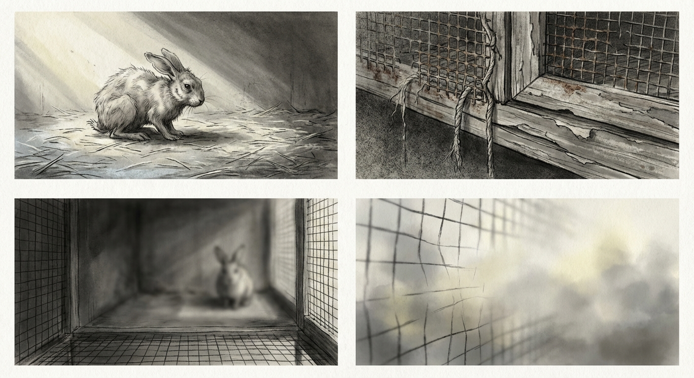

# Chapter 10: Return

---

Winter light lies thin across the ground.

The hawthorn stands bare above the hollow, branches reaching toward gray sky.

The body moves less now. Steps come slowly, each asking more than the one before. The warmth that once ran through everything has begun to thin, withdraw toward the center.

The hollow still holds the shape. The curve of earth worn smooth by two bodies through all the seasons. The nose follows it, finds hawthorn and soil. One body now. The emptiness counts itself.

---

Frost comes in the mornings. The body waits for the warmth that used to press against it, the warmth that never comes now. Each morning the waiting is shorter.

The gate still sounds. Food and water, low voices. Visits grow shorter. Hands reach down sometimes, touch the fur, withdraw. They carry more warmth than they used to, or the body carries less.

The body eats less. Returns to the hollow, sinks into the worn curve.

---

Scent of earth and hawthorn.

The nose searches among the roots, presses deeper into the soil. The body settles with space left at its side. Sister's flank used to lie warm against its own there. Now wind strokes through the fur.

Wind moves through the bare branches above. It carries sounds that could be breathing.

The ears turn toward it. The body rises, only a little, listening for the rhythm that used to match its own. Heartbeat answering heartbeat.

No. Only wind. Wind moving through hawthorn, through the hollow, through the emptiness where sister pressed close.

---

Snow falls one night.

The body wakes. White covers everything. The air hangs still and cold. The body's breath rises visibly, small clouds that disappear.

The hollow lies clear beneath the branches. Old habit carries the body toward it. Legs stiff. Joints aching. Each hop slower.

The hollow receives the body as it always has. The curved earth walls press inward. The body settles, breathing slowing, the heart beating its quiet rhythm.

This is the place. This has always been the place.

---

Days pass. Or perhaps they pass. Light comes and goes, though the body does not always rise to meet it. The gate sounds somewhere far away. Footsteps sometimes, a dish against the ground. Hands touch the fur, gentle pressure, warmth through fur.

The body stays in the hollow.

The hands release. The gate closes and the footsteps fade beyond the wire. Only wind through branches now, one breath close to the ground.

The pull that has lived in it since the first darkness, the pull toward earth, toward enclosed space, toward the safety of down and deep. That pull has found its answer here. Not the tunnel the body tried to dig in packed earth. Not the darkness beneath the wooden floor. But this: the hollow beneath the hawthorn, shaped by years of pressing, by seasons of resting, by two bodies and then one.

Earth beneath. At last, truly: earth beneath.

---

The heart slows.

The body registers it. No twitch of muscle, no quickening. Each beat comes after a longer pause now. The breathing follows the slowing. Shallow. Slow. Cold seeps deeper, or warmth draws farther away. The difference does not count.

The nose still catches traces. Hawthorn bark. Frozen earth. The body sinks into the worn curve, flank turned toward the place where sister lay. Muscles loosen, the same movement as through all those nights when fur pressed against fur.

The warmth at its side is gone. The breathing gone. The body still holds the shape: fur pressed against fur, another heartbeat close.

---

The light wanes.

Evening or eyes closing. No difference. The hollow holds the body. Earth presses up from beneath, no longer cold, no longer anything but receiving. The pull that has always been there, since the first darkness and the first warmth, the pull downward.

The pull ends here. The earth that was never reached, through all the scratching and digging and pressing against the wooden floor. That earth opens now. Receives now. The layer between body and ground thins to nothing.

---

Wind moves through the hawthorn.

It carries the sound of breathing. Or carries nothing. The ears no longer turn to follow it. The body rests in the hollow, pressed against earth, sinking into the shape it has worn.

Cold comes. All the warmth there was gathers at the center, shrinks, dims. The heart beats. Beats again. The pause between stretches long.

Scent of earth.
Scent of hawthorn.
Scent of.

---

Something releases.

The body stills into its final shape. The hollow holds what it was always meant to hold. Earth receives what was always its own.

Light is.
Sound is.
Scent is.
Earth is.

Then not separate. Then not body, not hollow, not hawthorn. Wind moves through branches and fur and the space where separation used to be.

All wind.
All earth.
All scent.

Fur in wind, wind in fur. No boundary between.
Earth beneath body, body in earth. No boundary between.
Scent, light, sound: no longer separate.

---

The hollow remains beneath the hawthorn, holding its shape. Spring comes again. Grass pushes through the thawing earth. New scents rise.

The gate sounds. Footsteps approach.

But the warmth that pressed here, that breathed here, that pulled toward earth through all those seasons.

That warmth is earth now.
Is everything now.
Is.

---
