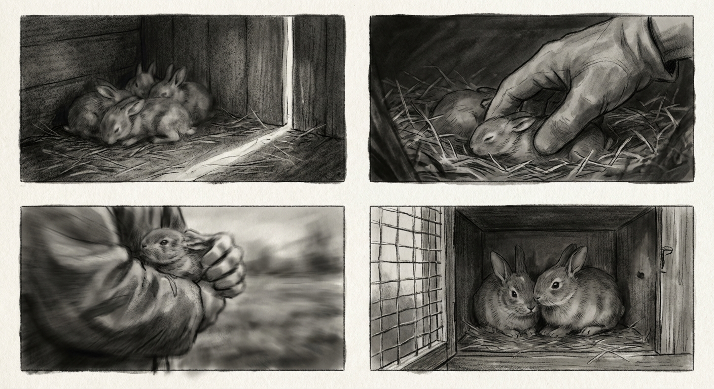

# Kapitel 2: Den första världen

---

Fyrkanten står öppen.

Ljus strömmar genom, bär dofter utifrån, skarpa och obekanta. Kroppen stelnar, nosen arbetar. Inte bolådans slutna mörker, inte mjölkdoft och modervärme. Något helt annat.

Systern bakom, nos framåt, morrhår darrande.

Hopp framåt. Golvet förändras. Brädor bredare, väggar längre isär, tak högre. Ljus faller i spjälor genom springor. Det här är själva buren.

---

Metallskål i ett hörn, fylld med små hårda kulor som doftar torkat gräs och säd. I en annan, vatten.

Kroppen närmar sig. Hunger djupare än försiktighet. Tänder sluts. Knastrande.

Torrt. Tätt. Bryter mellan tänderna på ett sätt som kräver malning, inte sugning. Smaken sprider sig: gräs, säd, något matigt. Buken svarar.

Systern väntar bakom. Närmar sig inte förrän den första kroppen stegar tillbaka. Då rör hon sig fram, tänderna arbetar på det som återstår.

En kropp närmar sig först, en väntar. Ordningen sätter sig.

Hö hänger från en träställning. Kroppen sträcker sig uppåt, tänderna fångar strån, drar loss. Långsam malning. Buken fylls annorlunda, inte med flytande värme utan med torr tyngd som lägger sig djupare.

Systern gör likadant från motsatta sidan, drar hö. Båda äter nu.

Mjölk borta. Det här återstår.

---

Fotsteg bortom träväggarna. Metall mot metall, klickande. Grinden.

Kroppen stelnar. Hjärtat snabbar.

Grinden öppnas inåt. Ljus översvämmar utrymmet. Långkroppar fyller öppningen, två, båda bärande skiktade dofter, främmande. Tyg och hud och något sött.

Händer in.

Kroppen platt mot bortre hörnet. Systern gör detsamma, båda små mot träet, hjärtan rusande, muskler spända och ingenstans att fly.

Men händerna finner matskålen, lyfter bort. Vattenskålen, häller ut gammalt, fyller nytt. Höställningen, trycker in färska strån.

Sedan händerna tillbaka. Grinden stängs.

Hjärtana saktar. Kropparna upptinar.

Mönstret börjar: grindljud, sedan händer, sedan mat, sedan tillbaka. Kroppen lär sig ljudet. Ljudet för med sig fullhet, inte fara.

---

Ljus ändrar vinkel genom springorna, högre, sedan lägre, sedan borta. Kroppen följer skiften. Ljust: aktivt. Dunkelt: vila. Mörkt: systern tryckt nära.

Nosen trycks mot springan mellan bräderna, söker dofter från bortom: jord, gräs, levande ting i fri luft.

Nosen mot samma springa om och om igen. Jord. Draget mot jord består, men springan erbjuder bara doft, aldrig själva jorden.

Systern bestiger ibland. Tyngd ned. Kroppen tillåter, väntar på slutet. Ingen riktning i det.

---

Kropparna växer. Ben längre. Öron högre. Hopp som förut täckte halva utrymmet korsar det helt nu.

Grindljudet, enda händelsen som bryter rytmen. Bortom väggarna fortsätter dofter att anlända. Jord. Gräs. Regn. Ting kroppen kan lukta men inte nå.

---

Draget växer starkare.

Jorddoft stiger tjock idag, fuktig och rik. Regn har fallit någonstans bortom. Tassar skrapar mot brädorna nära springan. Trä håller fast. Kroppen skrapar hårdare, instinkten djupare än motståndet. Gräv. Gryt.

Grinden.

Båda kropparna stelnar. Grinden öppnas. Ljus strömmar in, starkare än förut. Och med det: jorddoft, överväldigande, nära, inte silad genom springor utan flödande direkt genom öppningen.

Grinden stängs inte.

En gestalt i öppningen, den mindre långkroppen. Händer rör sig. Öppningen står kvar.

Kroppen närmar sig långsamt. Nos framåt. Öron höga.

---

Marken ändras under tassarna. Inte trä. Inte halm. Något som ger efter, som släpper doft med varje tryck av vikt. Jord. Verklig jord.

Bakom väntar systern vid tröskeln.

Ytterligare steg. Jorden håller. Luften rör sig, inte fångad mellan väggar utan flödande, kommande från överallt. Gräs, hagtornsbark, avlägset regn, varelser bortom sikt.

Kroppen sänker sig, trycker buken mot marken. Jorden sval mot huden, levande som trä aldrig var. Draget som levat i kroppen sedan första mörkret, draget nedåt, mot innesluten plats, mot jord, det draget finner äntligen sitt svar.

Systern genom grinden.

Två kroppar på jord nu. Öron höga och svängande, nosar läser den omöjliga nya världen. Väggarna står fortfarande, längre isär, men väggar ändå. Himlen öppnar sig ovan.

Men jord under.

Jord under.

---
