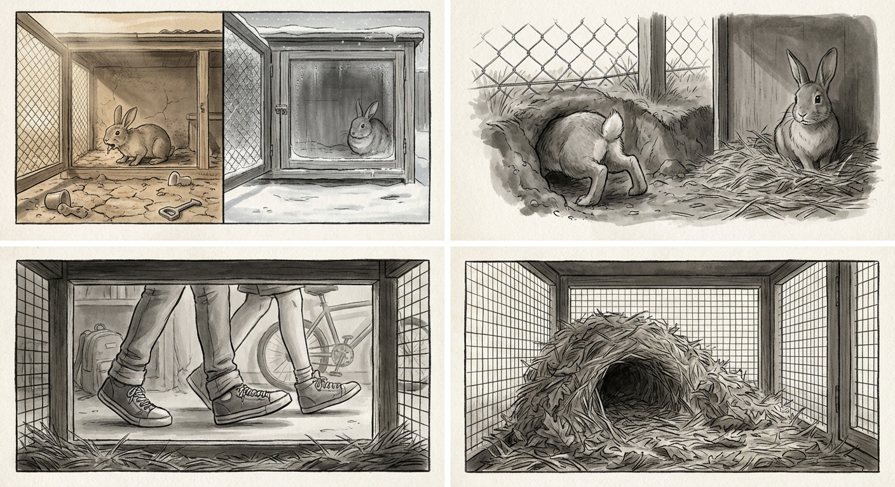

# Kapitel 6: Mellanåren

---

Rutinen djupnar in i kroppen.

Grinden låter varje morgon, varje kväll. Händerna sträcks in med mat och vatten. Gården håller sina gränser, gränserna håller kroppen som spårat dem otaliga gånger.

Nätet håller, förstärkt många årstider tillbaka. Kroppen cirklar omkretsen varje morgon, nosen söker svaghet som inte kommer. Systern bygger bo när våren anländer. Mönstren upprepas utan variation, årstider cirklar, åren hopar sig i slitna stigar och kroppar som växer tyngre, långsammare, gråare kring nosen.

Långkropparna har förändrats också. Rösterna har lagt sig i lägre tonläge, målbrottet avlöst av jämnare toner. De besöker mindre ofta nu, uppmärksamheten kortare.

Kropparna i gården anpassar sig. Mat kommer när mat kommer. Resten är vila.

---

Ny doft kommer med hösten.

Unken och skarp, bär spår av ammoniak. Något som jagar. Kroppen stelnar, hjärtat snabbar.

Rovdjur.

Källan dyker upp ovanför stängslet. Liten, päls fläckad orange och vit. Ung. Den faller ner i gården, landar klumpigt.

Kroppen plattas i hålan. Systern gör detsamma, andetag snabbt bredvid.

Det lilla rovdjuret rör sig framåt, prövar marken. Öron höga. Svans uppe.

---

Kroppen rör sig framåt, mot det. Hjärtat rusande. Musklerna spända. Men något driver kroppen framåt istället för bort. Detta är kroppen som åt först, som ledde, som gnagde genom nät.

Systern ligger kvar i hålan. Kroppen reser sig på bakbenen. Dunkar.

Ljudet knakar genom luften. Det lilla rovdjuret rycker till, hastar bakåt. En dunk till. Kroppen störtar framåt.

Rovdjuret hoppar uppåt, fångar stängslets kant, drar sig över. Borta.

---

Rovdjuret återvänder. Årstider passerar och det växer. Varje gång det faller ner i gården, varje gång kroppen reser sig, varje gång dunkandet kommer, varje gång det flyr.

Mönstret håller.

---

Det står fullvuxet nu. Tjock päls, ögonen fasta vid hålan. Men det går inte in. Det ligger på andra sidan stängslet, svansspetsen ryckande. Tittar.

Från hålan: hjärtat snabbar, men kroppen reser sig inte. Rovdjuret ligger kvar på andra sidan nätet.

---

Lederna värker mer i fuktigt väder nu. Hoppen kommer långsammare. Brådskan som en gång drev kroppen mot bortom har lagt sig till ro i något tystare.

Systern stannar närmare, vilar längre. Putsandet fortsätter mellan dem, tungan arbetar genom päls som växt grövre.

Två kroppar i hålan när kvällen kommer. Rovdjurets doft vid kanterna, öronen vända mot nätet.

---

Hagtornet har växt. Grenarna sprider sig vidare, stammen tjockare. Hålan under har vidgats också, formad av år av tryckande kroppar, nött slät av päls och bruk.

Båda kroppar passar lättare nu. Ömsesidigt slitande. Ömsesidigt formande. Hålan är deras på ett sätt som inte går att gräva bort.

Trädet bär årstiderna som kroppen inte håller tal på. Trädet fortsätter medan kropparna saktar under det.

---

Långkropparnas besök växer kortare. Ibland bara händer, placerar skålar, drar sig tillbaka. Stegen fortsätter bortom nätet, rösterna avtar.

Kropparna anpassar sig. De äter vad som ges när det ges. Hålan, värmen, systern tryckt nära.

---

Med våren bär systern hö igen. Hon drar päls från buken, men mindre päls samlas i hålan än förr. Längre mellan vändorna med hö, längre innan boet täcker jorden. Hon lägger sig där och väntar. Snart ligger det tomt igen.

Cykeln försvagas även när den fortsätter.

---

Hoppen som en gång bar kroppen över gården kommer nu med pauser emellan. Landningen efter varje hopp tar längre tid att sätta sig.

Kroppen närmar sig nätet ibland, nosen tryckt mot maskorna. Dofter från bortom strömmar fortfarande igenom: skog, jord, andras marker. Kroppen andas in dem, och det räcker.

Återvänder till hålan istället. Den bekanta krökningen tar emot, systerns bekanta värme tryckt nära.

---

Inte ungdom längre. Inte ålder än, fast åldern trycker vid kanterna, gör sig känd i värkande leder och långsammare rörelser.

Mitten är nu, och mitten bär allt: hagtornet spridande ovan, hålan nött slät nedan, systern vars doft har blivit ett med hålan, med hagtornet, med varje plats kroppen vilar.

Årstiderna fortsätter vända. Mönstret håller tills något vrider det mot ett slut.

För nu: mitten. Fortsättningen. Två kroppar i hålan när ljuset tunnas, värme delad, andning i takt.

Detta är vad åren har gjort.

---
